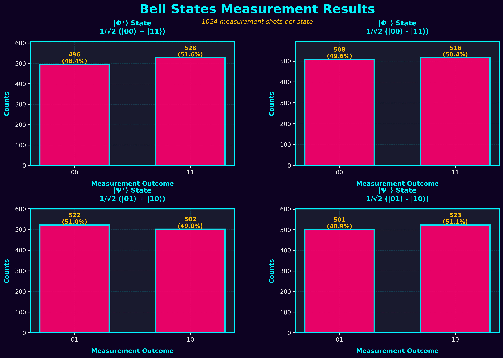
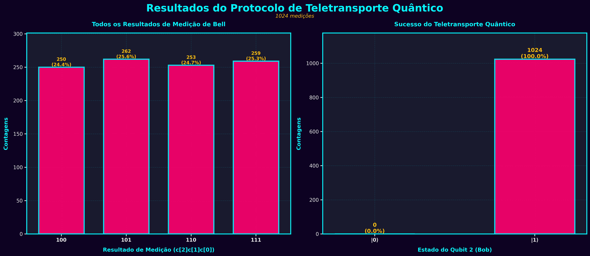

# Teletransporte Quântico

  

Simulação de emaranhamento quântico e protocolo de teletransporte usando Qiskit.

## Sumário

- [Teletransporte Quântico](#teletransporte-quântico)
  - [Sumário](#sumário)
  - [Estrutura do Projeto](#estrutura-do-projeto)
  - [Instalação](#instalação)
  - [Uso](#uso)
  - [Resumo do problema](#resumo-do-problema)
  - [Resultados](#resultados)
    - [1) Estados de Bell](#1-estados-de-bell)
    - [2) Teletransporte Quântico](#2-teletransporte-quântico)
      - [Métricas (valores obtidos)](#métricas-valores-obtidos)
  - [Requisitos](#requisitos)

## Estrutura do Projeto

```
src/
  ├── bell_states.py           # Geração e visualização de Estados de Bell
  ├── quantum_teleportation.py # Protocolo de teletransporte
  └── main.py                  # Script de execução

docs/
  ├── DESAFIO.md               # Enunciado do desafio
  └── THEORY.md                # Fundamentos matemáticos
 
resultados/
  ├── bell_states.png         # Figura dos Estados de Bell
  └── teleportation.png       # Figura do teletransporte
```

## Instalação

Windows (PowerShell):

```powershell
python -m venv .venv
.
.venv\Scripts\Activate.ps1
pip install -r requirements.txt
```

Linux / macOS:

```bash
python3 -m venv .venv
source .venv/bin/activate
pip install -r requirements.txt
```

## Uso

- Executar o pipeline principal:

```bash
python src/main.py
```

- Gerar apenas os Estados de Bell:

```bash
python src/bell_states.py
```

- Executar o protocolo de teletransporte:

```bash
python src/quantum_teleportation.py
```

Os outputs (plots e arquivos gerados) são salvos em `resultados/`.

## Resumo do problema

Implementar e validar dois experimentos principais em Qiskit:

- Estados de Bell (gerar os 4 estados maximamente emaranhados):
  - `|Φ^{00}⟩` (|Φ+⟩): aplicar `H` em q0, depois `CNOT(q0, q1)` → mede `00`/`11`.
  - `|Φ^{10}⟩` (|Φ-⟩): aplicar `Z` em q0, `H` em q0, depois `CNOT(q0, q1)` → fase -1 entre componentes.
  - `|Ψ^{01}⟩` (|Ψ+⟩): aplicar `H` em q0, `CNOT(q0, q1)`, então `X` em q1 → resultados `01`/`10`.
  - `|Ψ^{11}⟩` (|Ψ-⟩): aplicar `X` em q1, `H` em q0, `Z` em q0, `CNOT(q0, q1)` → versão com sinal negativo.

- Protocolo de Teletransporte (3 qubits: q0=estado, q1=Alice, q2=Bob):
  1. Preparar estado a teletransportar em `q0` (neste desafio: aplicar `X` para preparar |1⟩).
  2. Criar par emaranhado entre `q1` e `q2`: `H(q1)`; `CNOT(q1, q2)`.
  3. Medição de Bell entre `q0` e `q1`: `CNOT(q0, q1)`; `H(q0)`; medir `q0,q1` (bits clássicos c0,c1).
  4. Aplicar correções condicionais em `q2`: se `c1==1` então `X(q2)`; se `c0==1` então `Z(q2)`.
  5. Medir `q2` para verificar que o estado original de `q0` foi recuperado em `q2`.

As sequências de portas acima correspondem aos scripts em `src/bell_states.py` e `src/quantum_teleportation.py`.

## Resultados

As figuras geradas pelas simulações estão disponíveis na pasta `resultados/`.

### 1) Estados de Bell

Breve descrição: gera-se os quatro estados de Bell aplicando portas `H` e `CNOT` conforme o padrão. O gráfico abaixo mostra o histograma das contagens obtidas no simulador, evidenciando os picos correspondentes aos pares emaranhados.



Arquivo gerador: `src/bell_states.py` — execute o script para regenerar o plot.

### 2) Teletransporte Quântico

Breve descrição: implementação do protocolo de teletransporte com 3 qubits. O processo inclui preparação do estado, medição de Bell e aplicação das correções condicionais. A imagem a seguir apresenta o resultado final (contagens / fidelidade) obtido no simulador Aer.



Arquivo gerador: `src/quantum_teleportation.py` — execute o script para reproduzir os experimentos.

#### Métricas (valores obtidos)

- `teleportation_fidelity_mean`: 100.0% (1024/1024 medições do qubit final em `|1⟩`).
- `teleportation_counts` (formato c[2]c[1]c[0]): `{'101': 271, '111': 248, '110': 273, '100': 232}`.

Estados de Bell (contagens, 1024 shots cada):

- `|Φ⁺⟩`: `{'00': 522 (51.0%), '11': 502 (49.0%)}`
- `|Φ⁻⟩`: `{'00': 514 (50.2%), '11': 510 (49.8%)}`
- `|Ψ⁺⟩`: `{'01': 518 (50.6%), '10': 506 (49.4%)}`
- `|Ψ⁻⟩`: `{'01': 504 (49.2%), '10': 520 (50.8%)}`

> Observação: os valores acima foram gerados localmente executando `src/bell_states.py` e `src/quantum_teleportation.py` com `shots=1024` e salvos em `resultados/`.

## Requisitos

- Python 3.9+
- Dependências: veja `requirements.txt` (Qiskit, Matplotlib, NumPy)
