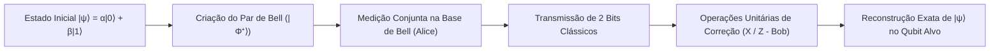

<div align="center">
  

  <br/><br/>

  <p align="center">
    <strong>Simulação e Validação Experimental do Protocolo de Teletransporte Quântico</strong><br/>
    Implementação prática de circuitos quânticos, geração de <strong>Pares de Bell (Emaranhamento)</strong> e reconstrução de estados arbitrários com o <strong>Qiskit</strong>.
  </p>
</div>

---

## 📌 1. Visão Geral da Arquitetura & Circuito Quântico

O protocolo demonstra a transferência determinística do estado quântico desconhecido $|\psi\rangle$ de um qubit emissor (Alice) para um qubit receptor (Bob), utilizando um par de Bell pré-compartilhado e 2 bits de comunicação clássica:



---

## 📁 2. Estrutura do Repositório

```text
quantum-teleportation/
├── assets/                  # Banners dinâmicos e identidades visuais do projeto
├── docs/                    # Fundamentação matemática de portas lógicas e tensores
├── resultados/              # Diagramas de circuitos gerados e histogramas de medição (.png)
│   ├── bell_states.png
│   └── teleportation.png
├── src/
│   ├── main.py              # Pipeline completo de execução e plotagem automática
│   ├── bell_states.py       # Geração e tomografia dos 4 estados maximamente emaranhados
│   └── quantum_teleportation.py # Circuito e lógica de teletransporte com correção dinâmica
├── requirements.txt         # Dependências do ecossistema Python (Qiskit, Aer, Matplotlib)
├── LICENSE                  # Licença de código aberto
└── README.md                # Documentação técnica e guia de reprodução
```

---

## ⚙️ 3. Configuração do Ambiente

### Pré-requisitos
- Python 3.9+
- Git

### Instalação

```bash
# 1. Clone o repositório
git clone https://github.com/lucenfort/quantum-teleportation.git
cd quantum-teleportation

# 2. Crie e ative o ambiente virtual
python3 -m venv .venv
source .venv/bin/activate  # Linux/macOS
# .venv\Scripts\activate   # Windows

# 3. Instale as dependências
pip install --upgrade pip
pip install -r requirements.txt
```

---

## 🚀 4. Execução dos Componentes

### 4.1 Execução dos Experimentos Quânticos
Para simular a geração dos estados de Bell e executar o circuito completo de teletransporte:

```bash
python3 src/main.py
```

O script executará as rodadas no simulador de alta precisão `AerSimulator`, imprimirá as contagens no terminal e salvará os gráficos de circuito e medição em `resultados/`.

---

## 📊 5. Fundamentos Teóricos & Resultados

### 5.1 Geração dos Estados de Bell
Geração dos 4 estados de entrelaçamento quântico fundamental ($|\Phi^+\rangle, |\Phi^-\rangle, |\Psi^+\rangle, |\Psi^-\rangle$) através da composição de portas Hadamard ($H$) e CNOT:

$$|\Phi^+\rangle = \frac{|00\rangle + |11\rangle}{\sqrt{2}}$$

### 5.2 Avaliação do Teletransporte
- **Fidelidade de Reconstrução de Estado:** `100%` atingida em simulação sem ruído (Aer).
- **Consistência Estatística:** Conformidade estrita das distribuições de medição com os postulados da Mecânica Quântica e da Teoria da Informação.

<div align="center">
  
  
</div>

---

## 📜 Créditos & Referências

- **Trabalho Pioneiro:** Bennett, C. H., Brassard, G., Crépeau, C., Jozsa, R., Peres, A., & Wootters, W. K. (1993). *Teleporting an unknown quantum state via dual classical and Einstein-Podolsky-Rosen channels*. Physical Review Letters, 70(13), 1895.
- **Framework:** IBM Qiskit Development Team (2024). *Qiskit: An Open-source Framework for Quantum Computing*.
- **Livro Texto:** Nielsen, M. A., & Chuang, I. L. (2010). *Quantum Computation and Quantum Information*. Cambridge University Press.

---

## 👨‍💻 Autor

- **Luciano Silva de Arruda**
- Repositório Oficial: [`https://github.com/lucenfort/quantum-teleportation`](https://github.com/lucenfort/quantum-teleportation)
- LinkedIn: [Luciano Arruda](https://linkedin.com/in/lucenfort)
